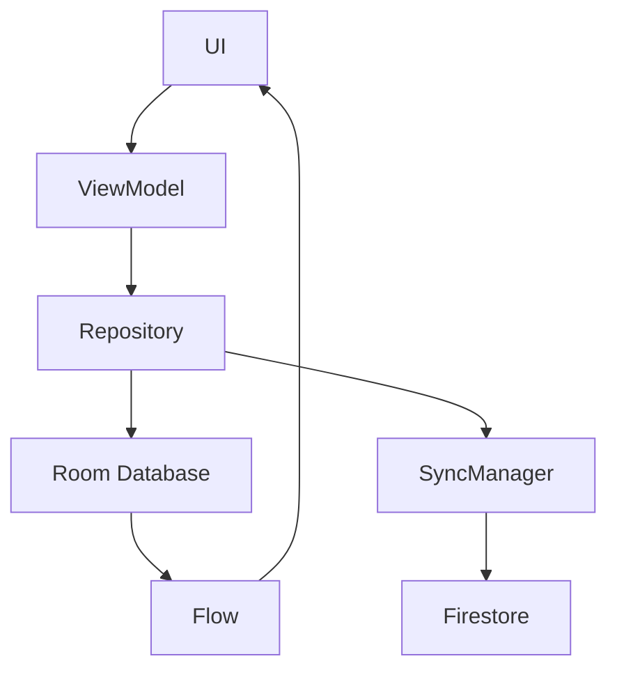

# ShopMe Architecture

ShopMe follows a **Clean Architecture + Reducer Pattern + State-driven UI** approach.

Core goals:

* deterministic UI behavior
* clear separation of concerns
* scalable architecture
* realtime synchronization
* future offline-first capability

---

# High-Level Architecture

```mermaid
flowchart TD

UI[Compose UI] --> VM[ShoppingViewModel]

VM --> REDUCER[Reducer<br>reduce(state, action)]

REDUCER --> STATE[ShoppingUiState]

STATE --> VIEWSTATE[ShoppingViewState]

VIEWSTATE --> UI

VM --> EFFECTS[SideEffects]

EFFECTS --> USECASES[Domain UseCases]

USECASES --> REPO[Repository]

REPO --> FIRESTORE[Firestore Database]
```

---

# Layer Responsibilities

## UI Layer (Compose)

Responsible for:

* rendering UI
* sending user events
* observing ViewState

Examples:

```
ShoppingScreen
StoreSelectionDialog
ItemRow
```

UI must **never modify state directly**.

---

## Presentation Layer

Contains:

```
ShoppingViewModel
Reducer
ShoppingAction
ShoppingUiState
ShoppingViewState
```

Responsibilities:

* dispatch actions
* update UI state via reducer
* execute side effects
* combine domain data into ViewState

---

## Domain Layer

Contains business logic.

Examples:

```
CreateListUseCase
DeleteListUseCase
SetActiveListUseCase
```

Domain models:

```
ShoppingItem
ShoppingListEntity
StoreType
```

The domain layer **must not depend on Android or Firebase**.

---

## Data Layer

Handles persistence and external services.

Components:

```
FirestoreShoppingRepository
Firestore
SnapshotListener
```

Responsibilities:

* read/write lists
* read/write items
* realtime updates

---

# Architecture Principles

### Unidirectional Data Flow

```
UI Event
  ↓
Action
  ↓
Reducer
  ↓
New State
  ↓
Compose UI
```

---

### Reducer is Pure

The reducer:

* receives `(state, action)`
* returns a new state
* performs **no side effects**

---

### Side Effects

Side effects run **after the reducer**:

```
Action
 ↓
Reducer
 ↓
New State
 ↓
SideEffect
 ↓
UseCase
 ↓
Repository
```

---

# Future Architecture (Offline First)

ShopMe is designed to evolve toward an offline-first architecture.



Benefits:

* instant UI updates
* offline usage
* conflict resolution
* improved performance
