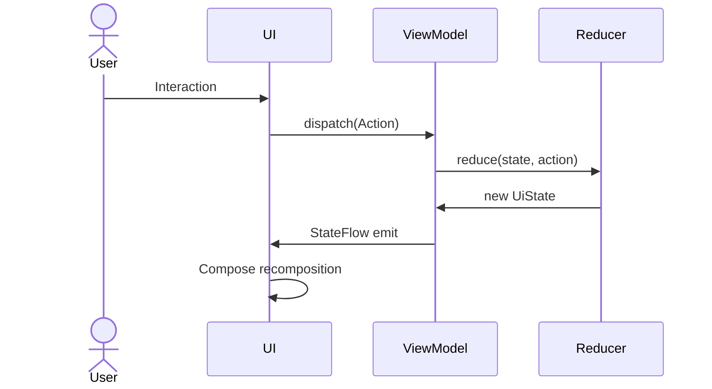
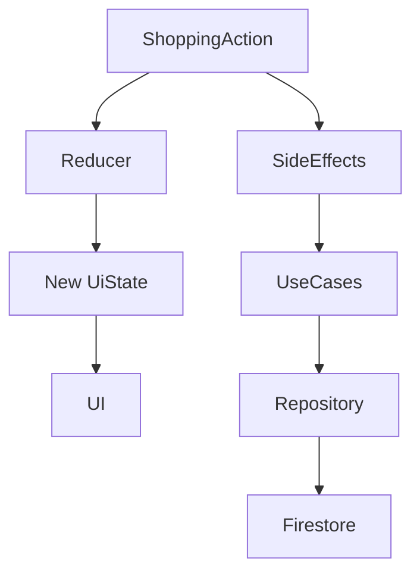
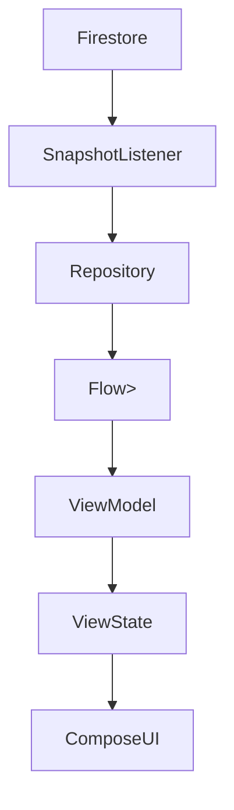
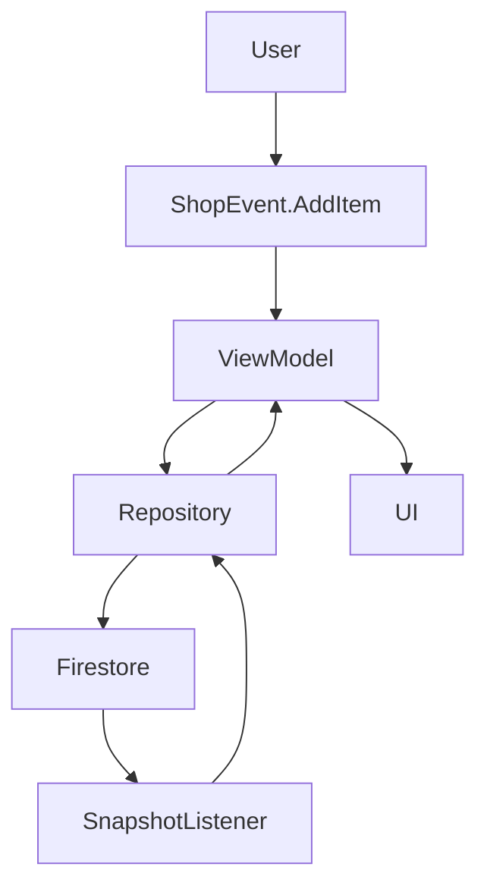
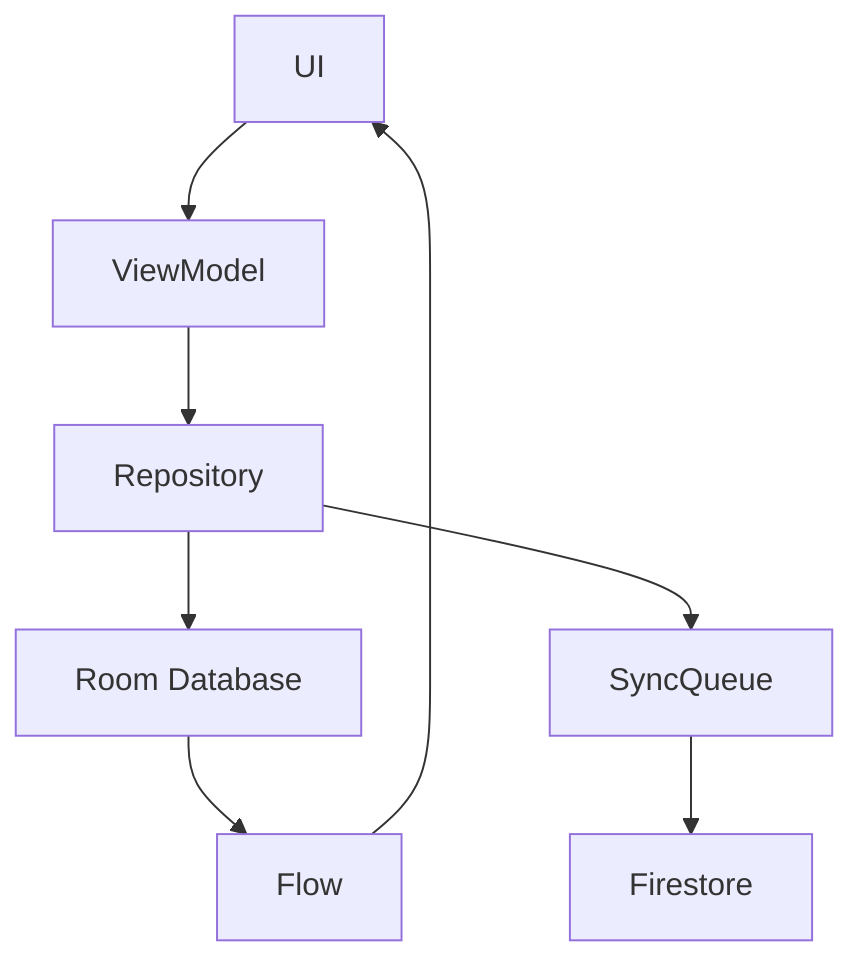

# ShopMe Data Flow

ShopMe follows **Unidirectional Data Flow**.

Data always moves in a predictable direction.

---

# UI Event Flow



---

# Example: Toggle Store

```
RadioButton Click
   ↓
ToggleStore Action
   ↓
Reducer
   ↓
MultiSelect(selectedStores updated)
   ↓
UI recomposition
```

---

# Side Effect Flow

Side effects are executed after state transitions.



Example:

```
ConfirmStores
 ↓
Reducer → MultiOverview
 ↓
createListUseCase()
 ↓
Firestore
```

---

# Firestore Realtime Flow



---

# Item Update Flow



---

# Future Offline-First Flow



Offline-first behavior:

```
UI writes → Room
Room emits → UI updates instantly
SyncQueue → Firestore
```
