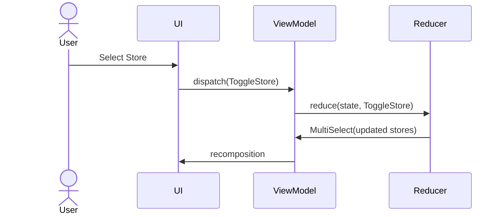
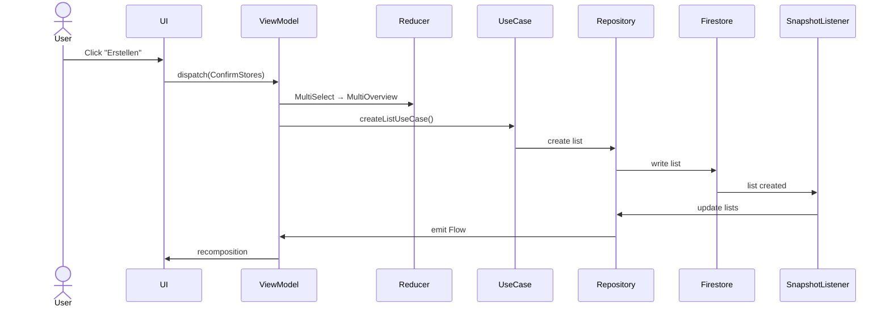

# ShopMe Event Flow

This document describes how **user interactions flow through the ShopMe architecture**.

The system follows a **Reducer Pattern + SideEffect Architecture**.

Events travel through the system in a predictable pipeline.

---

# Event Processing Pipeline

```mermaid
flowchart TD

User[User Interaction] --> UIEvent[UI Event]

UIEvent --> Dispatch[ViewModel.dispatch(action)]

Dispatch --> Reducer[Reducer reduce(state, action)]

Reducer --> NewState[New ShoppingUiState]

NewState --> UIUpdate[Compose UI Recomposition]

Dispatch --> Effects[handleSideEffects()]

Effects --> UseCases[Domain UseCases]

UseCases --> Repository[Repository]

Repository --> Firestore[Firestore Database]

Firestore --> Snapshot[SnapshotListener]

Snapshot --> Repository

Repository --> ViewModel

ViewModel --> UIUpdate
```

---

# Example: Store Selection



---

# Example: Confirm Store Creation



---

# Example: Delete List

```mermaid
sequenceDiagram

actor User

User ->> UI: Swipe Delete

UI ->> ViewModel: dispatch(DeleteList)

ViewModel ->> Reducer: Normal → MultiOverview

ViewModel ->> UseCase: deleteListUseCase()

UseCase ->> Repository: delete list

Repository ->> Firestore: delete document

Firestore ->> SnapshotListener

SnapshotListener ->> Repository

Repository ->> ViewModel

ViewModel ->> UI: recomposition
```

---

# Architecture Guarantees

The event flow ensures several important guarantees.

### Deterministic UI

```text
State changes only happen inside the reducer
```

---

### SideEffect Isolation

```text
Network / database operations are executed outside the reducer
```

---

### Predictable Data Flow

```text
User Event
 → Action
 → Reducer
 → New State
 → UI Update
 → SideEffect
 → Repository
 → Firestore
 → Snapshot Update
 → UI Update
```

---

# Benefits

This architecture provides:

* predictable state transitions
* easier debugging
* easier testing
* scalable architecture
* robust realtime synchronization

---

# Relation to Other Patterns

ShopMe combines ideas from:

* Redux
* MVI (Model View Intent)
* State Machines
* Clean Architecture
* Realtime Sync Systems
