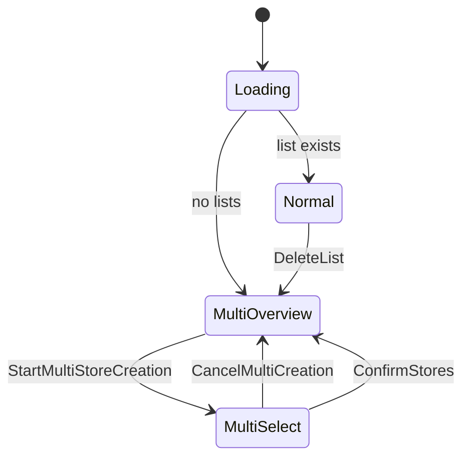

# ShopMe UI State Machine

ShopMe uses a **state machine** to control navigation and dialogs.

The UI reacts entirely to `ShoppingUiState`.

---

# State Diagram



---

# State Descriptions

## Loading

Initial state while the application determines:

* if lists exist
* which list is active

---

## MultiOverview

Displayed when:

* multiple lists exist
* no list is currently open

User actions:

```
StartMultiStoreCreation
SelectList
DeleteList
```

---

## MultiSelect

Dialog for creating lists for stores.

User can:

* select predefined stores
* add custom stores

Actions:

```
ToggleStore
ConfirmStores
CancelMultiCreation
```

---

## Normal

Main shopping list screen.

User actions:

```
AddItem
ToggleItem
DeleteItem
DeleteList
```

---

# State Transition Rules

### Creating Lists

```
MultiOverview
  ↓
StartMultiStoreCreation
  ↓
MultiSelect
  ↓
ConfirmStores
  ↓
MultiOverview
```

---

### Deleting Lists

```
Normal
  ↓
DeleteList
  ↓
MultiOverview
```

---

# Guard Logic

The ViewModel contains guards to maintain a valid state.

Example:

```
if (no lists exist)
→ MultiOverview + WelcomeDialog
```

These guards prevent inconsistent UI states.
